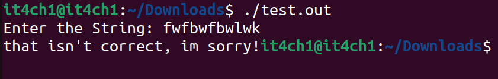
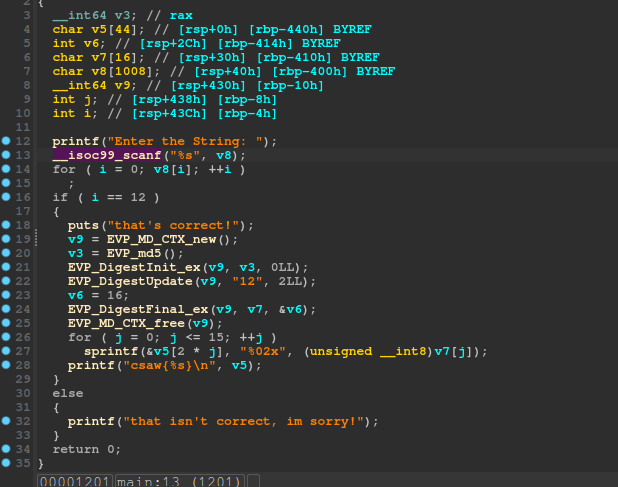
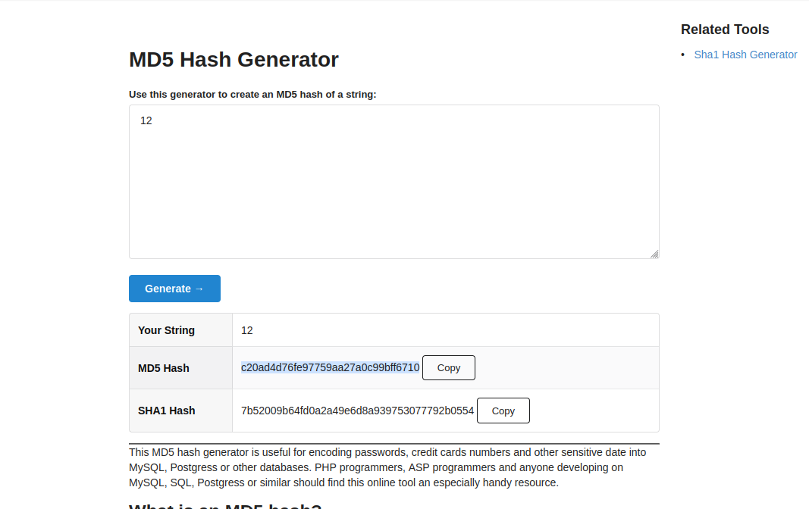

 We are given an ELF file oir an exectuable binary to reverse thus we will start by running it:

 - Here we observe:

Thus it is a simple crackme: 
 - So let's run the binary into IDA and see the decompiled view 

 

 - Thus we can easily see that the program is generating MD5 hash of the integer 12 and then comparing it with the input given by the user.

So we need the MD5 hash of the integer 12 ->
**c20ad4d76fe97759aa27a0c99bff6710**

## Thus our flag will be 

**csawctf{c20ad4d76fe97759aa27a0c99bff6710}**

