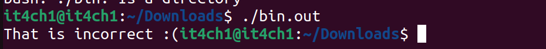
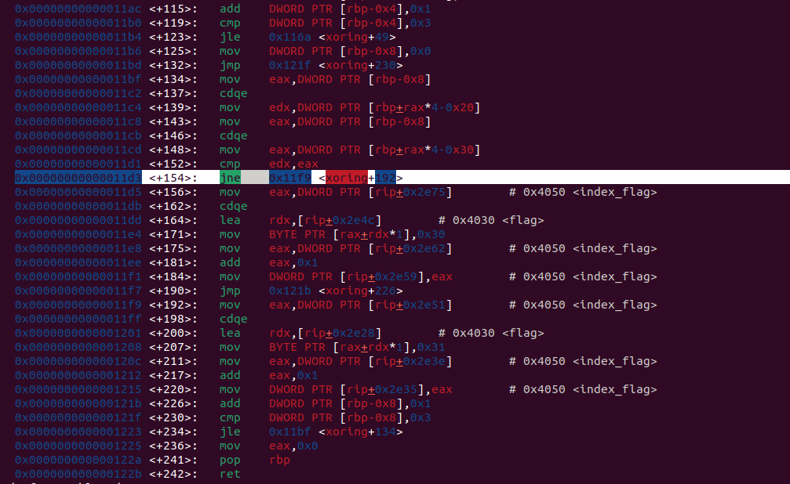
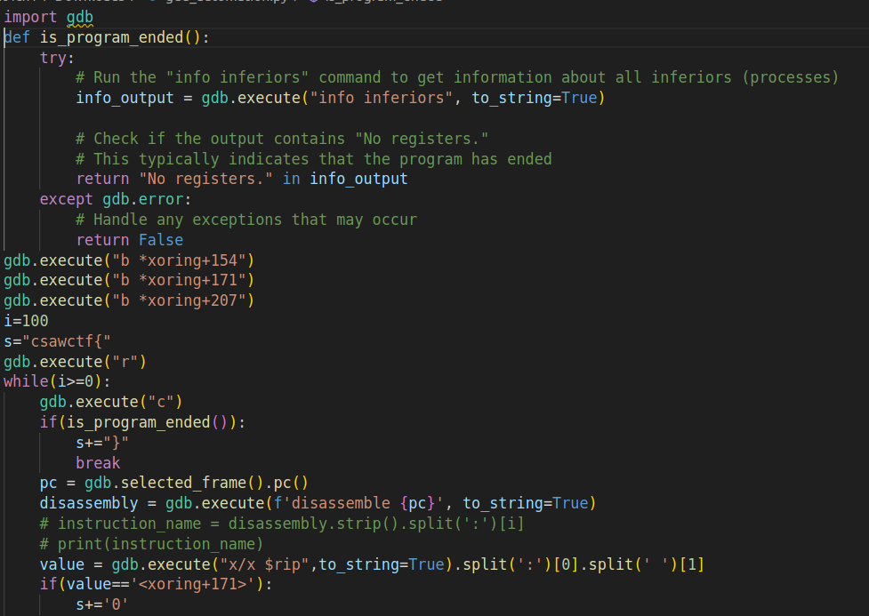
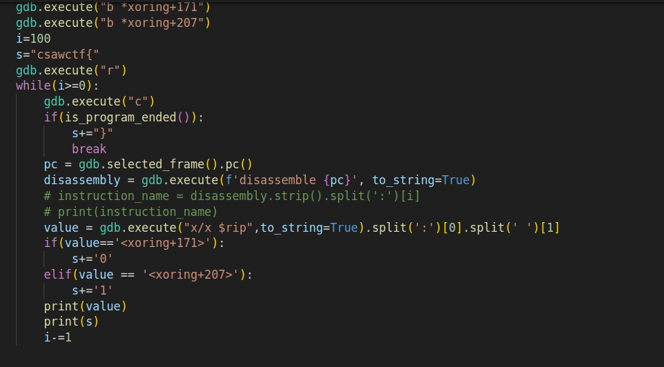
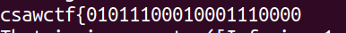

- Here we are given a binary named 'bin.out'. Thus we first try to run it.

- Thus the binary never asks for any input so we have to open it in gdb-pwndbg debugger to see what it is doing on the inside.

In the gdb we get that there are two functions -> xoring and printbinchar that probably tries to print the flag but the program exits before.

- Thus we disassemble the function xoring inside the gdb and observe that a lopp is going on at a place to print the flag .

- The highlighted condition 'jne' is implementing a while loop.

- If the condition is fulfilled then chr(0x30) is added to the flag else the jump is taken and chr(0x31) is added to the flag 

**Thus we can write a simple script in python gdb to automate this process->**

- Use this command in your terminal to run this script

**THIS SCRIPT WILL GIVE US THE REQUIRED FLAG:**

Now add the '}' at last yourself :p