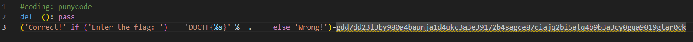
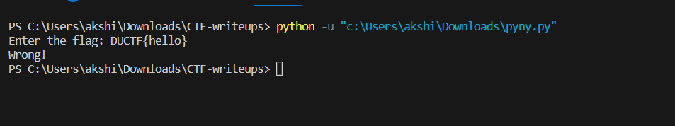
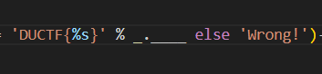
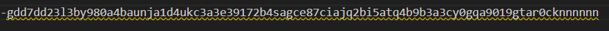
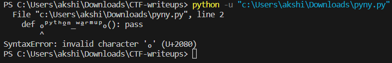

# **pyny.py**

**We are given a file named 'pyny.py' and as we open it :**

 -  We observe that the (coding: punycode) defines that the coding directive of the whole program is punycoding , which is an encoding used in the URL hiding through python . 

- First we try to run the code:

    

- From this we can infer this that the program has no error and it is just asking for a flag with a hidden string inside the "DUCTF{}" curly braces.

 - I wasted a lot of time trying to find any library for the conversion of punycode to python or any readable text format but didnot find any 

 - Then I tried to analyse the code again.

 

- String formatting is being used here to check if the string referred by %s is Correct or not.

- After the second '%' symbol the referred string is placed. Thus we can infer that we require to get the value of '_' here as string.

- And so to get the name of the function I added random characters at the end of the punycode to raise an error in the function so that python will tell me the name of the function causing the error.

 

 - And i got this as error:
  

- Thus the name of the function given is python_warmup and so the flag will become:

**DUCTF{python_warmup}**