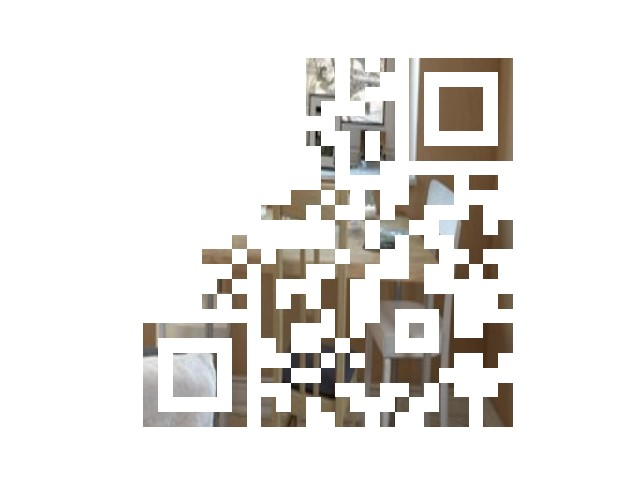
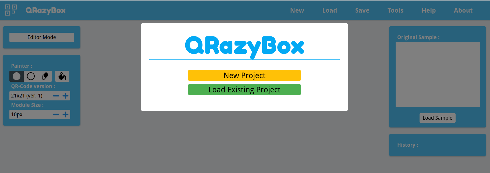
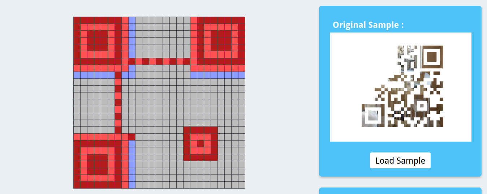
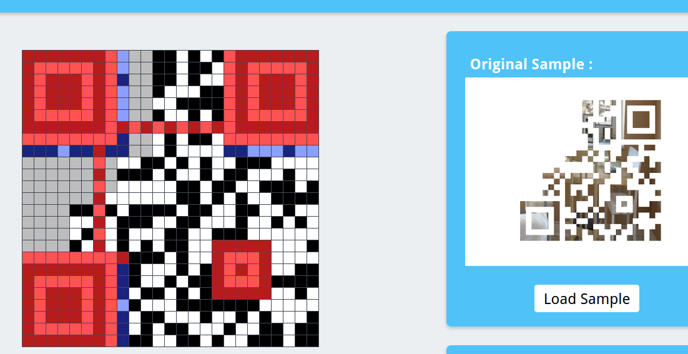
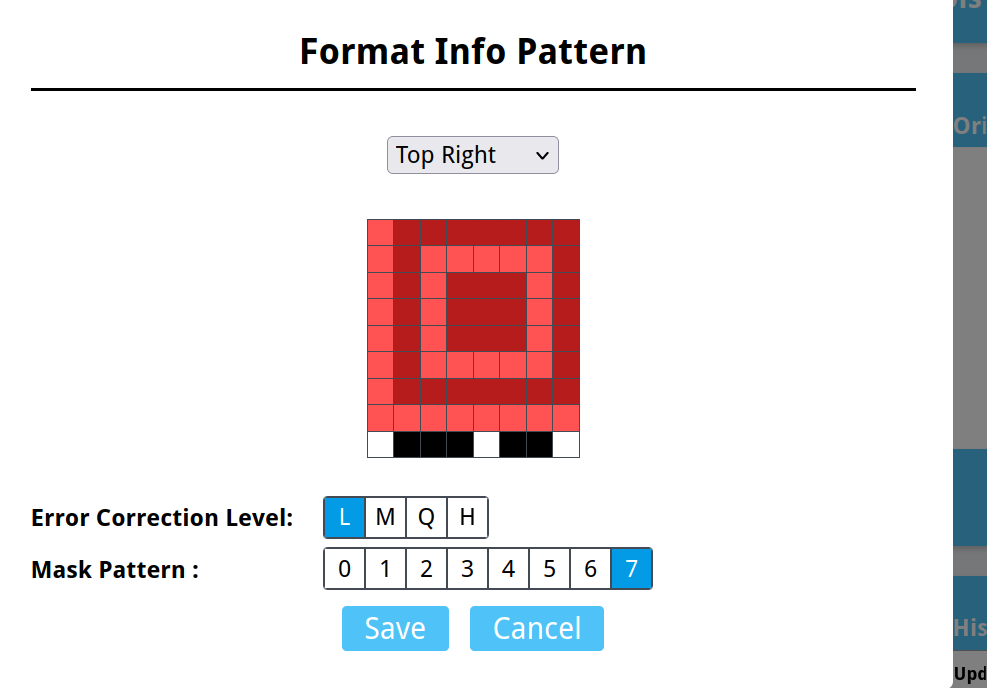
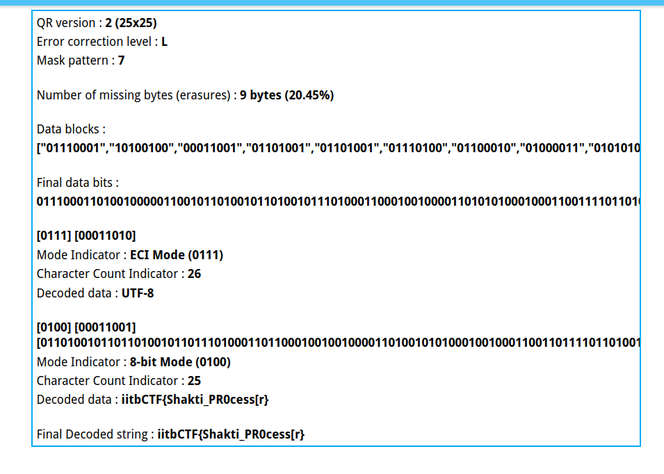

# Find_Find!

**We are given an image that is a broken QR code:**

- So we have to repair the QR code and so I started browsing any online tool for this : 

- And then I ended up at the tool **QrazyBox** :

**https://merri.cx/qrazybox/**

- Load the original sample of the QR code you have and then create a new blank QR code . note that it should be of dimensions **25X25** as we are getting idea through right side of our our broken QR code.

- Replicate all the squares in the blank QR code one by one.

- Then observe the line just one below the big squares and set them to L7.

- Now we have replicated the broken QR code given.

- Now extract the information and get the flag .

- In the QR code I made a square mistake although the flag is ->

### iitbCTF{Shakti_PR0cessOr}